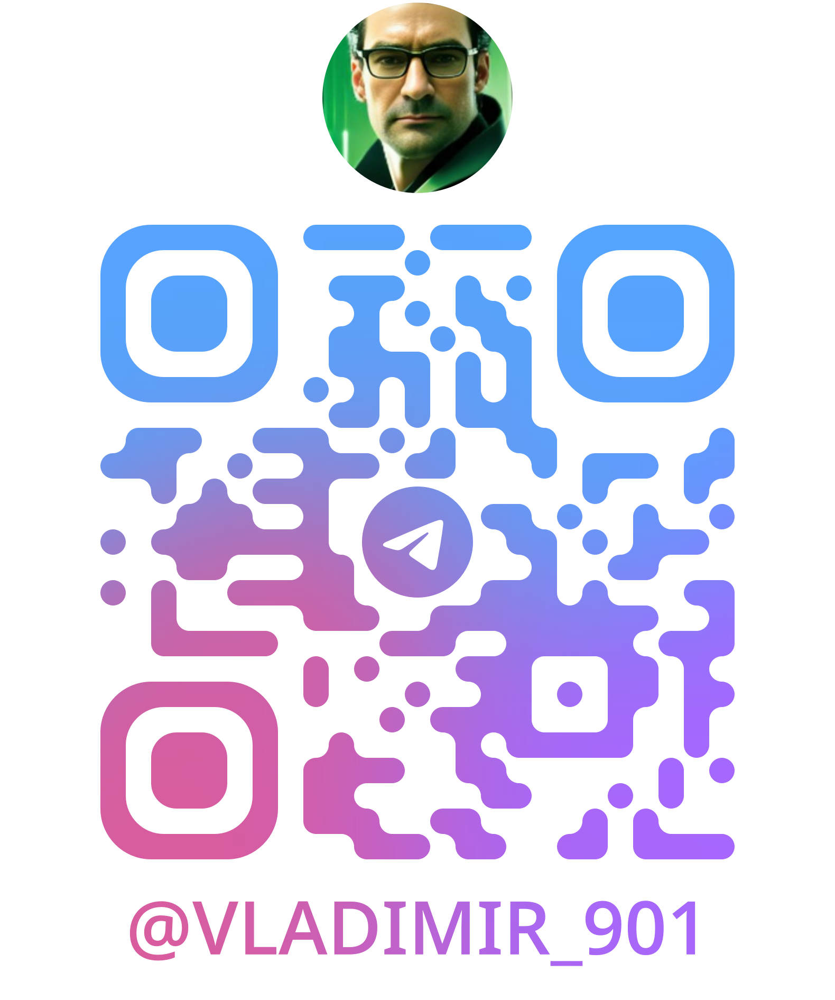

# **Lead Software Engineer (Embedded & Full-Stack)**

---

### **CONTACTS**

- **Location:** Kobuleti, Ajara Republic, Georgia (Open to relocation)
- **LinkedIn:** [linkedin.com/in/](https://linkedin.com/in/suhot)
- **GitHub:** [Val-d-emar](https://github.com/Val-d-emar)
- **Discord:** [Vlad.i.mir](https://discordapp.com/users/1182354659659227216)
- **Telegram:** [Vladimir_901](https://t.me/Vladimir_901)

### **SUMMARY**

A highly skilled and versatile Software Engineer with over 28 years of experience in designing, developing, and leading complex technical projects. Expert in Embedded Linux systems (C++, Python, QML) DevOps Engineering (CI/CD, K8s, Terraform) and full-stack web development (PHP, Python, Type Script). Proven ability to lead development teams, manage the entire product lifecycle from requirements to deployment, and solve complex architectural challenges. A dedicated Linux user for over 25 years (Debian, Ubuntu, RedHat) as a primary OS for both professional and personal use.

---

### **SKILLS**

- **Operating Systems:** Linux (Debian, Ubuntu, RedHat, SUSE - 25+ years of experience), Windows.
- **Programming Languages:** C, C++, Python, JavaScript, TypeScript, Java, Bash, SQL.
- **Embedded Systems:** Embedded Linux, ARM, NXP i.MX, Raspberry Pi, STM32, Qt (QtWidgets, QtQuick), CMake, QEMU, Cpack, AT-Commands.
- **Web Development:** React, Node.js, WordPress, Bootstrap, HTML, CSS, WebSocket, REST API, GraphQL, TypeORM, Prisma.
- **Databases:** MySQL, PostgreSQL.
- **DevOps & Tools:** Docker, Terraform, Git, GitLab CI/CD, Jira, GoogleTest, Jest, Postman, Bruno, STM32CubeIDE, PlatformIO, ArduinoIDE, Android Studio, Notion, Markdown.
- **Cloud Services:** Amazon Web Services (AWS), Oracle Cloud.
- **Protocols & Interfaces:** HTTPS, SSL, JSON, CSV, RS-232/485, CAN, HID, VCP, MIL-STD-1553.
- **Methodologies & Standards:** Agile (Kanban), GOST (ESPD, NIR), Code Review, Unit Testing, Technical Documentation.

---

### **WORK EXPERIENCE**

**September 2023 – Present**
**Sole Proprietorship "Friends Realty Batumi"** | Batumi, Georgia
_Full-Stack Web Developer_

- Developed and enhanced websites (landing pages, corporate portals) according to client specifications.
- Integrated custom scripts, marketing tools, and analytics platforms (Google Analytics, Yandex.Metrica).
- Administered hosting and cloud infrastructure on AWS and Oracle Cloud.
- Created infrastructure-as-code scripts for automated deployment using Terraform.
- Conducted API and functional testing using Jest, Postman, and Bruno.
- _Technologies: WordPress, React, Node.js, JS/TS, Docker, Terraform, MySQL, PostgreSQL, REST/GraphQL._

**May 2023 – August 2023** (4 months)
**Piklema LLC** | Moscow, Russia
_Embedded Software Engineer_

- Developed embedded software on C++/Qt/QtWidgets for Raspberry Pi (ARM), including UI/UX from Figma designs, an HTTPS update library, and JSON/CSV parsing.
- Engineered SSL communication with a server via AT-commands on a SYM7600 modem (C) and enhanced the serial port multiplexer driver.
- Configured GitLab CI/CD pipelines and developed Bash scripts for building and packaging firmware images (.img).
- Built and maintained a cross-compilation toolchain with Qt and a native QEMU emulator for ARM.
- Implemented unit tests using GoogleTest, integrating them into the CI/CD pipeline.
- Operated within an Agile (Kanban) framework using Jira for task management.

**September 2018 – October 2022** (4 years 2 months)
**Kalashnikov Concern JSC** | Moscow, Russia
_Lead Design Engineer_

- Engineered and prototyped a control panel for a distributed hardware system using STM32 (C/C++, STM32CubeIDE, PlatformIO) with RS-232/485 and CAN interfaces.
- Developed an Android-based HMI (Java, Android Studio) using HID/VCP protocols for controller communication.
- Modeled object trajectories and automated complex processes using Python.
- Migrated legacy control system models from MathWorks Simulink to Python, implementing a library of digital filters based on Z-transforms.
- Managed the full cycle of technical and design documentation in compliance with GOST standards (ESPD, NIR).

**February 2008 – August 2018** (10 years 7 months)
**"KBtochmash" JSC & "NPO Karat" JSC** | Moscow & St. Petersburg, Russia
_Head of Department / Chief Design Engineer_

- Led the full development lifecycle of dual-use naval electronics, including gyrostabilized optical and radar systems.
- Managed a team of developers, overseeing technical specification, decomposition, planning, and task allocation.
- Designed electrical schematics and test equipment for production and validation.
- Developed communication protocols and emulators for interfacing with ship systems (RS-232/485/422, MIL-STD-1553).

**(Previous experience from 1994-2008 as Head of Laboratory and Lead Engineer is detailed in the full resume and available upon request)**

---

### **PROJECTS**

**rest-client-app**

- **Description: The lightweight version of Postman for building and using APIs.**.
- **Tech Stack:** `React`, `Next`, `Type Script`.
- **Link:** [rest-client-app](https://github.com/Val-d-emar/rest-client-app)

**Translate serial data to udp**

- **Description: The sample task for translate serial data to udp.**.
- **Tech Stack:** `C++`, `C, Qt`, `Linux`.
- **Link:** [serial2udp](https://github.com/Val-d-emar/serial2udp)

**Sending the contents of a text file line by line to an MQTT broker topic**

- **Description: The sample task for sending the contents of a text file line by line to an MQTT broker topic.**.
- **Tech Stack:** `C++`, `C`, `Qt`, `Linux`.
- **Link:** [mqttrun](https://github.com/Val-d-emar/mqttrun)

**An example of tasks to generate and visualisate random data**

- **Description: The sample task to generate and visualisate random data.**.
- **Tech Stack:** `Python`, `Flask`, `Docker`.
- **Link:** [vdservices](https://github.com/vhot2076/vdservices)

### **CODE EXAMPLE**

- **Task:** Find the sum over the segment.
- **Link:** [codeforces](https://codeforces.com/edu/course/3/lesson/10/2/practice/contest/324367/problem/A)
- **Solution (Python):**

```python
n = input()
s = input()
rcount = int(input())

sa = s.split()

b = [0]
for i,ss in enumerate(sa):
    b.append(b[i]+int(ss))

for i in range(0,rcount):
    lr = input()
    lrs = lr.split()
    l = int(lrs[0])-1
    r = int(lrs[-1])
    s = int(b[r]) - int(b[l])
    print(s, flush=True, end='\n')
```

- **Task:** Prefix sums: Constructing prefix sums.
- **Link:** [codeforces](https://codeforces.com/edu/course/3/lesson/10/1/practice/status)
- **Solution (Python):**

```python
n = input()
s = input()
sa = s.split()
b = [0]
for i,ss in enumerate(sa):
    b.append(b[i]+int(ss))
print(b.__str__()[1:-1].replace(", ", ' '), flush=True, end='\n')
```

---

### **EDUCATION**

**1997**
**Saint Petersburg State University of Aerospace Instrumentation** | Saint Petersburg, Russia
_M.S. in Radio Engineering, Faculty of Radio Engineering_

---

### **LANGUAGES**

- **Russian:** Native
- **English:** B1 (Intermediate)
- **French:** A2 (Elementary)
